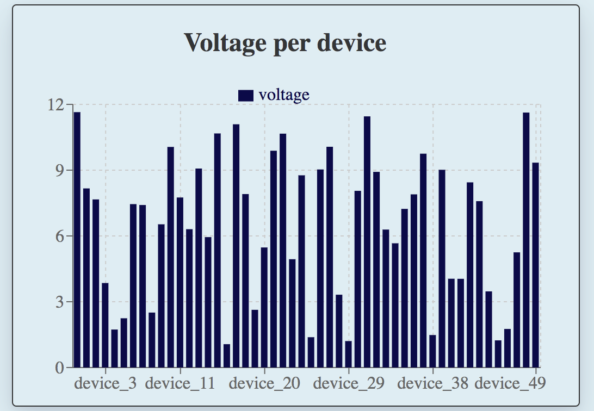
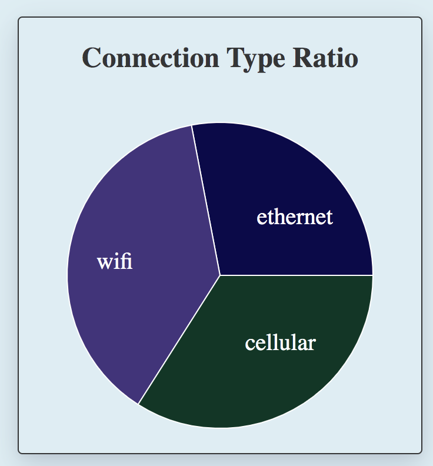
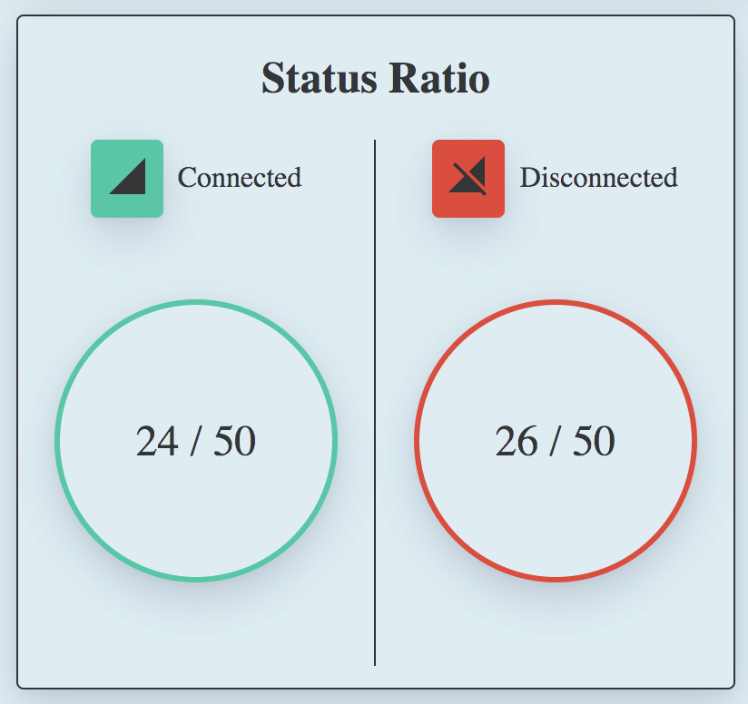
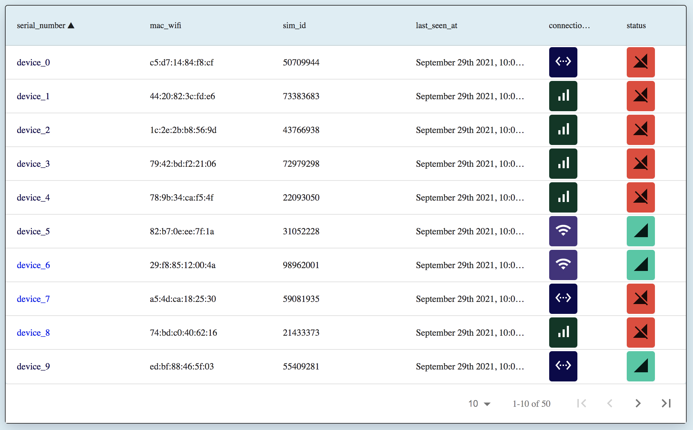
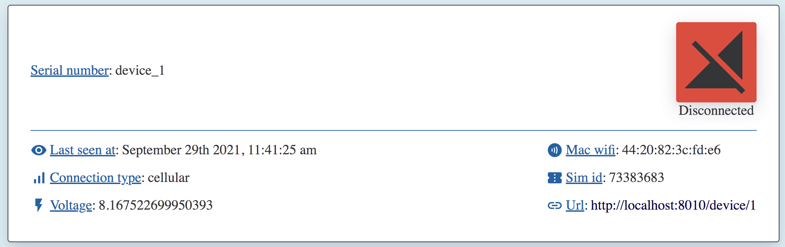

# Dashboards
An app that displays a dashboard from API data

## Menu
[How to use App with docker-compose](#how-to-use-app-with-docker-compose)

[How to use App with no docker](#how-to-use-app-with-no-docker)

[Note](#note)

## How to use App with docker-compose

### Quick start (API & App)

---

`docker-compose up`

---

/!\ It might take few minutes to start because of the `npm i` command and the `webpack` build for front-end app and storybook. /!\

App will be accessible on port `4000` and storybook on port `6006`

## How to use App with no docker

### Quick start (API & App)

---

1- Start the API using `uvicorn backend.main:app --host 0.0.0.0 --port 8010 --reload`
2- Install dependencies using `npm i`
3- Start the App using `npm start`

---

### Commands for App

#### Start

---

- `start` : use `per-env` to call either `start:development` or `start:production` depending on the variable `NODE_ENV`. By default
this variable is set to `development`. This script will start the express app that serve the front-end. App will be accessible on port 4000.
- `start:development`: start the express in app with hot reload and serve the front-end also with hot reload.
- `start:production`: build the app and start it in production mode.
- `start-front`: use `per-env` to call either `start-front:development` or `start-front:production` depending on the variable `NODE_ENV`. By default
  this variable is set to `development`. This script start the front-end using `webpack` server.
- `start-front:development`: start the front with `webpack` with hot-realod
- `start-front:production`: build and start the front with `webpack`, no hot-realod

---

#### Build

---

- `build`: build the app : backend with `tsc` and frontend with `webpack`
- `build:front`: build only the frontend with `webpack`
- `build:server`: build only the backend with `tsc`

---

#### Test

---

- `test` : run tests for backend and frontend
- `test:update`: run tests for backend and frontend and update snapshots
- `cover`: run tests and check coverage thresholds

---

#### Lint & prettier

---

- `lint` : use `eslint` to check linting
- `lint:fix`: use `eslint` to fix linting issues
- `prettier:fix` : use `prettier` to beautify code

---

#### Storybook

---

- `storybook` : start `storybook`
- `storybook:build` : build `storybook` static assets

---

## Note

### Dashboard

This App is composed of a backend and a front-end.

*(We will not be talking about the API in this note since the API has been provided and could be replaced)*

#### Architecture and best practices

##### Architecture

The app is built with 2 principal folders : `server` and `src`.
`server` is the express backend and `src` contains everything the frontend needs to work.
In `src` there are sub folders :
- `components` contains all the components needed for the App. In this project, a "component" is a React component that does not have
  any logic in it. A component can work in different use cases, it does not need a specific context to be used. The provided props are the
  only context they need to be functional.
- `containers` contains all the containers needed for the App. In this project, a "container" is a React component that needs context, logic,
  state, Api call,... For example, a container can not be used in another project context.
- `style` contains the style variable and the global style of the application
- `test-utils` contains mock or set up files to be used in tests
- `types` contains all the component and data types for Typescript
- `utils` contains methods, helpers, config that would be needed in project

For each component | container | utils |..., a folder `tests` contains the test made with `Jest` and `React-testing-library`.

##### Best practices

This project respect some naming rules for the files :
- A file that refers to a `component` should be named `[ComponentName].component.tsx` and its test `[ComponentName].component.test.tsx`
- A file that refers to a `container` should be named `[ComponentName].container.tsx` and its test `[ComponentName].container.test.tsx`
- A file that refers to a component|container style should be named `[componentName].style.tsx`
- A file that refers to a component|container utils should be named `[componentName].utils.tsx`
- A file that refers to a component|container story should be named `[componentName].story.tsx` and be placed in a `stories` file

Each container | component have an `index.ts` file to make imports easier. 
We do not want to create a component in an `index.ts` file to make it easier to maintain and refactor code. 
A component should be written in a `[ComponentName].component.tsx` and exported in the `index.ts` file.

The graphic assets (colors, spaces, etc) should be referenced in the `styles/variables.ts` file. We use ts variable instead of
css variable to make it easier to maintain, and if we need to use the variables in different environment (design system, graphic app, etc).
The style for each component is made with `styled-component`.

Each component, some containers, and basic style assets are exposed in Storybook in order to have a reference of the design to create the design system
of the App.

Each file is tested at least with a snapshot.

#### Backend

The backend is made with `Node`, `Express` and `Typescript`. It helps front-end to call this API. Calling API from backend
allows us to handle [CORS](https://developer.mozilla.org/fr/docs/Web/HTTP/CORS/Errors) and provide a
same origin for frontend and api calls.

The server has 3 routes :
- `api/devices` to call API and get all devices
- `api/device/:id` to call API and get a specific device from its id
- `/` to serve the build front-end using `webpack`

The backend is used to control and handle API calls. In this case it is only meant to serve the local API response 
instead of using directly browser.
In a bigger React App, using an express backend could be [useful](https://codeburst.io/why-would-you-implement-a-backend-for-your-react-app-365bb8a8431d)
for server-side-rendering or for call a data-base.

#### Front-end

The frontend is made with React and built using webpack. 
There is a frontend routing policy using `react-router`.
There are 2 frontend routes `/` and `/device/:id`.

### Route /

This route is the main route of the App. It displays the "Global Dashboard".
It calls a custom [React hook](https://fr.reactjs.org/docs/hooks-intro.html) to fetch all the devices data using the backend route `api/devices`
For now the data are loaded once and stocked in cache. To improve this app we could add a "Refresh" button to get fresh data.
Or we could get the info in real-time by refetching the data every x time.
So, in this App example all visuals are displaying the information for a fixed instant (when the data has been fetch).
Also, we are fetching all the 50 mocked devices provided by the API, but we could load data by package of x devices and improve performance.
It is composed of 4 visuals to monitor devices :

This chart displays the voltage for each device when the data has been loaded. On hover user can see the detail of the data.
For example : "device_48, voltage: 12.3983"

This chart display the ratio of each connection type so user can see the number of device that has the specific connection_type.
On hover, it will display the number in plain text, for example hovering 'wifi' it will show "wifi: 19".

This chart displays the number of connected device and the number of disconnected devices.

This table shows all devices generic information such as "serial_number" "mac_wifi", "sim_id", "last_seen_at", "connection_type" and "status".
Each category (each column) is sortable by clicking the category name in the header. By default, the table only displays 10 devices / page
but user can choose to see more devices in each page. This component could be improved by adding filters. For example a text input
where user can write a specific serial number to show only the matching device(s), or by adding checkboxes to display only connected (or disconnected) devices.

In the "serial_number" column, each item is clickable and redirect to `/device/[device_id]`.

### Route /device/:id

This route displays the detail of one specific device. It calls a custom [React hook](https://fr.reactjs.org/docs/hooks-intro.html) to fetch the device data using the backend route `api/device/:id`
The `:id` param is get by the browser url. For example in browser if user goes on `/device/1` it will call the backend route `api/device/1`.
Such as the request for all devices, there is no way to refresh data at this time, but the custom React hook can be improved to allow "refresh" on click
or every x time.

This component displays all the info for the specific device.

This component simulates voltage data "in real time". There is a re-fetch call every 5 seconds so the chart line is updated with new value
every 5 seconds. Since the API only return a fix value, the component use a Math.random methods to mock what could be a real life voltage
data. It allows user to monitor the voltage of a specific device in real time. The live chart can be started and stopped at any time.
